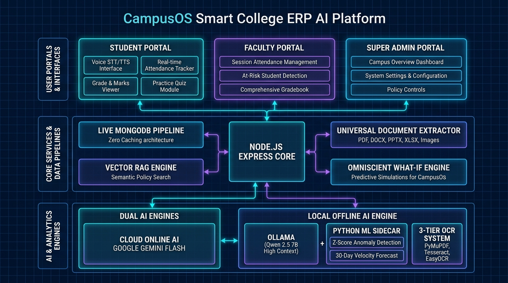
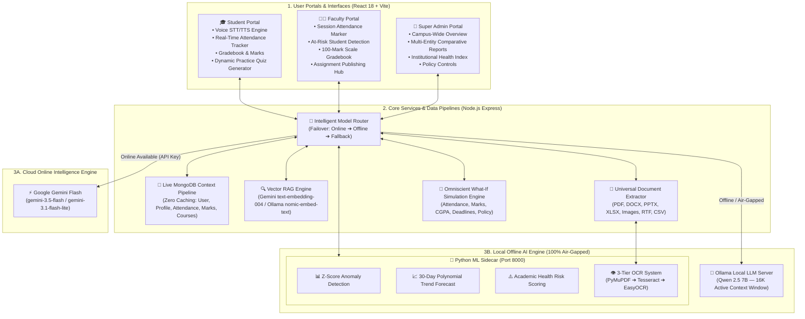

# 🎓 CampusOS - Smart College ERP System with Omniscient AI Co-Pilot & Machine Learning Core

Welcome to **CampusOS**, an enterprise-grade Academic Enterprise Resource Planning (ERP) platform and Autonomous Multi-Role AI Assistant built for modern colleges and universities.

CampusOS unifies **Administrative Governance**, **Faculty Academic Workflows**, **Student Self-Service Portals**, and a **Hybrid Dual-Engine AI Architecture** (Cloud Google Gemini Flash + Air-Gapped Local Ollama Qwen 2.5 7B with Python ML Sidecar) featuring bidirectional voice synthesis and an omniscient What-If simulation engine.

---

## 📑 Table of Contents
1. [System Overview & Architecture](#-system-overview--architecture)
2. [Dual-Engine Cognitive AI System (Online + Offline)](#-dual-engine-cognitive-ai-system-online--offline)
3. [Architecture Block Diagram](#️-architecture-block-diagram)
4. [Interactive System Mermaid Flowchart](#-interactive-system-mermaid-flowchart)
5. [Core ERP Modules & AI Capabilities](#-core-erp-modules--ai-capabilities)
   - [👑 1. Super Admin Command Portal & Admin AI](#-1-super-admin-command-portal--admin-ai)
   - [👨‍🏫 2. Faculty Academic Portal & Faculty AI Co-Pilot](#-2-faculty-academic-portal--faculty-ai-co-pilot)
   - [🎓 3. Student Self-Service Portal & Student AI](#-3-student-self-service-portal--student-ai)
6. [🧪 Omniscient "What-If" Simulation Engine](#-omniscient-what-if-simulation-engine)
7. [📄 Universal Document & Syllabus Ingestion (3-Tier OCR)](#-universal-document--syllabus-ingestion-3-tier-ocr)
8. [⚡ Real-Time Data Engine & Zero-Caching Pipeline](#-real-time-data-engine--zero-caching-pipeline)
9. [🗄️ Database Schemas & Entity Models](#️-database-schemas--entity-models)
10. [📡 API Endpoints Reference](#-api-endpoints-reference)
11. [🛠️ Technology Stack](#️-technology-stack)
12. [🚀 Getting Started & Installation](#-getting-started--installation)
13. [🔒 Security & Air-Gapped Data Isolation](#-security--air-gapped-data-isolation)

---

## 🌟 System Overview & Architecture

CampusOS solves the fragmentation of modern college administrative operations by providing a single, unified, reactive web platform:

```
                                  ┌─────────────────────────────────────────────────────────┐
                                  │               🎓 CampusOS ERP Core Platform             │
                                  └─────────────────────────────────────────────────────────┘
                                                               │
                 ┌─────────────────────────────┼─────────────────────────────┐
                 ▼                             ▼                             ▼
   ┌───────────────────────────┐ ┌───────────────────────────┐ ┌───────────────────────────┐
   │    👑 Admin Portal        │ │   👨‍🏫 Faculty Portal       │ │    🎓 Student Portal       │
   │  • Student Admissions     │ │  • Course Allotment       │ │  • Live Attendance Tracker  │
   │  • Faculty Directory      │ │  • Daily Session Marker   │ │  • Subject Marks & CGPA     │
   │  • Dept & Curriculum      │ │  • 100-Mark Gradebook     │ │  • Coursework Submissions   │
   │  • System Audit Overviews │ │  • Assignment Publishing  │ │  • Smart Profile & Resume   │
   │  • Multi-Entity Reports   │ │  • At-Risk Interventions  │ │  • Practice Quiz Generator  │
   └───────────────────────────┘ └───────────────────────────┘ └───────────────────────────┘
                 │                             │                             │
                 └─────────────────────────────┼─────────────────────────────┘
                                               │
                                               ▼
                                 ┌───────────────────────────┐
                                 │  🤖 Autonomous AI Engine  │
                                 │  • Online: Google Gemini  │
                                 │  • Offline: Qwen 2.5 (7B) │
                                 │  • Python ML Sidecar      │
                                 │  • Bidirectional Voice    │
                                 └───────────────────────────┘
```

---

## 🧠 Dual-Engine Cognitive AI System (Online + Offline)

CampusOS is engineered to function flawlessly in both high-speed cloud environments and completely disconnected, air-gapped campus intranets:

### 1. Cloud Online Engine (Google Gemini)
* **Primary Models**: `gemini-3.5-flash`, `gemini-3.1-flash-lite`, `gemini-flash-latest`.
* **Latency**: Ultra-fast **1–2 second responses** via Google's cloud tensor infrastructure.
* **Vector RAG**: Powered by Google's `text-embedding-004` (768 dimensions) for deep conceptual regulation retrieval.

### 2. Local Offline Engine (Ollama + Python ML Sidecar)
* **Active LLM**: **Qwen 2.5 (7.6B Parameters, Q4_K_M Quantization, 32K Context Window)**.
* **High-Context Engine**: Configured with `num_ctx: 16384` and `num_predict: 1500`, accepting up to **28,000 characters of uploaded syllabus text** in a single prompt.
* **Dynamic Model Auto-Discovery (`getBestOllamaModel`)**: Automatically queries Ollama's local registry (`/api/tags`) and picks the best installed model (`qwen2.5:7b` ➔ `llama3.1:8b` ➔ `llama3.2:3b` ➔ `phi3:latest`).
* **Offline Vector RAG**: Uses local neural embeddings (`nomic-embed-text`) with automatic fallback to normalized 128-dimensional mathematical word vectors.
* **Python Machine Learning Sidecar (`ml_service/app.py` on Port 8000)**:
  * **Statistical Anomaly Detection (`/api/ml/anomaly`)**: Computes attendance Z-scores using NumPy/Pandas to identify sudden drop-offs.
  * **30-Day Trend Velocity Forecast (`/api/ml/forecast`)**: 1st-degree polynomial regression modeling future attendance trajectories (`UPWARD`, `STABLE`, `DOWNWARD`).
  * **Multi-Factor Dropout Risk Scoring (`/api/ml/risk-score`)**: Multi-variable academic health index (0–100).
  * **Vectorized Policy Simulation (`/api/ml/simulate`)**: Cohort-wide hypothetical parameter simulator.

---

## 🖼️ Architecture Block Diagram



---

## 🔄 Interactive System Mermaid Flowchart



---

## 🏛️ Core ERP Modules & AI Capabilities

### 👑 1. Super Admin Command Portal & Admin AI
The administrative control plane provides omniscient institutional visibility:
* **Student & Faculty Directory**: Complete CRUD operations, ID allocation, department mapping, and contact registers.
* **Campus-Wide Attendance Audit**: Real-time attendance rate tracking across departments with instant shortage listings.
* **Super Admin AI Engine**:
  * **Multi-Entity Queries**: When asked about both a student and faculty member, produces distinct structured markdown sections for each entity.
  * **Direct Details**: Outputs exact student IDs, contact numbers, emails, attendance %, and CGPA cleanly without database meta-talk.
  * **Institutional Digital Twin**: Analyzes campus velocity and department health scores (0–100).
  * **Policy Simulations**: Predicts the impact of relaxing attendance criteria on student retention.

---

### 👨‍🏫 2. Faculty Academic Portal & Faculty AI Co-Pilot
Simplifies classroom administration and student performance monitoring:
* **Session Attendance Marker**:
  * Record Forenoon (`FN`) or Afternoon (`AN`) sessions with topics covered.
  * Batch marking: `PRESENT`, `ABSENT`, or `ON-DUTY`.
* **100-Mark Scale Gradebook**:
  * Semester Exam (Max 60) + Internal/Assignment (Max 20) + Practical/Lab (Max 20) = Total (Max 100).
  * Automatic letter grade allocation (`O`, `A+`, `A`, `B+`, `B`, `C`, `F`).
* **Faculty AI Co-Pilot**:
  * **At-Risk Detection**: Identifies students below 75% attendance or with failing internal marks.
  * **Proactive Dispatcher**: Generates draft advisory notices for students and mentors.
  * **Remedial Simulation**: Simulates the recovery effect of scheduling extra classes.

---

### 🎓 3. Student Self-Service Portal & Student AI
An intelligent companion for students:
* **Live Attendance Tracker**:
  * Real-time percentage with status indicator (`Safe` vs `Shortage`).
  * Safe-to-miss calculator (*"You can safely miss up to X classes"*).
  * Recovery calculator (*"You must attend next Y classes to reach 75%"*).
  * Subject-by-subject attendance and date-by-date session history logs.
* **Student AI Co-Pilot**:
  * **Voice Interface**: Hands-free voice query input (STT) and natural female voice synthesis (TTS).
  * **Strict Concise Mode**: Direct 1–2 sentence answers containing the requested figure (detailed breakdowns provided only on request).
  * **2-Decimal Accuracy**: All percentages formatted to exact 2-decimal places (e.g. `84.50%`).
  * **Dynamic Practice Quiz Generator**: Generates unit-specific MCQs from uploaded course syllabi.

---

## 🧪 Omniscient "What-If" Simulation Engine

CampusOS features a mathematical simulation engine active across **both Online (Gemini) and Offline (Qwen 2.5)** modes:

| Domain | What-If Question Example | Underlying Mathematical Calculation |
| :--- | :--- | :--- |
| **Attendance (Missing)** | *"What if I miss 2 classes next week?"* | `Projected % = (Present) / (Total + 2) * 100`. Warns if student falls below 75%. |
| **Attendance (Attending)** | *"What if I attend the next 5 classes?"* | `Projected % = (Present + 5) / (Total + 5) * 100`. Confirms if student reaches safety. |
| **Semester Exams** | *"What if I score 52 in semester exam?"* | `Total = Exam (52/60) + Internal (18/20) + Practical (18/20) = 88/100` ➜ Grade: **A+**. |
| **CGPA / GPA** | *"What if my SGPA this semester is 8.8?"* | Calculates credit-weighted cumulative CGPA projection across past and present semesters. |
| **Assignments** | *"What if I don't submit Assignment 2?"* | Forfeits 10 internal marks; projects new internal total and risk to passing minimum. |
| **Faculty Remedials** | *"What if I take 3 remedial classes?"* | Evaluates at-risk roster; calculates how many students cross 75% into safe status. |
| **Admin Policy** | *"What if we lower condonation cutoff to 70%?"* | Executes cohort simulation; counts how many students across departments avoid exam debarment. |

---

## 📄 Universal Document & Syllabus Ingestion (3-Tier OCR)

Students, faculty, and administrators can upload any document directly into the AI chat:

* **PDF Documents**: Fast digital text extraction via `pdf-parse` / `pymupdf`.
* **Scanned/Image PDFs**: Multi-tier OCR pipeline:
  1. **Tier 1 (PyMuPDF `fitz`)**: Fast digital text layer scan.
  2. **Tier 2 (Tesseract OCR `pytesseract`)**: High-resolution 200 DPI image OCR.
  3. **Tier 3 (EasyOCR)**: Pure Python neural OCR fallback (zero external binary dependencies).
* **Office Documents**: Native parsing for Word (`.docx` via `python-docx`), PowerPoint (`.pptx` via `python-pptx`), and Excel (`.xlsx` via `openpyxl`).
* **Text & Data Formats**: CSV, JSON, Markdown, RTF, and plain text.
* **High-Context Quiz Synthesis**: Reads up to **28,000 characters** and generates unit-wise MCQs with options `A/B/C/D`, Answer Key, and concept explanations.

---

## ⚡ Real-Time Data Engine & Zero-Caching Pipeline

CampusOS queries the database live on every prompt:

| Event | Database Update | AI Behavior |
| :--- | :--- | :--- |
| **Attendance Marked** | Faculty records daily class status. | Student AI reflects the updated percentage on the **very next prompt**. |
| **Marks Published** | Faculty saves internal exam marks. | Student AI immediately reports the new score and re-calculates CGPA. |
| **Date-Specific Query** | Student asks: *"Was I present on September 1st?"* | Searches `dailyRecords` for `2026-09-01` and returns exact session statuses. |
| **New Assignment** | Faculty posts coursework with deadline. | Student AI immediately includes it in pending assignments. |

---

## 🗄️ Database Schemas & Entity Models

```
┌─────────────────┐       ┌─────────────────┐       ┌─────────────────┐
│      User       │1     1│ StudentProfile  │1     *│   Attendance    │
│─────────────────│───────│─────────────────│───────│─────────────────│
│ _id             │       │ user (FK)       │       │ userId (FK)     │
│ name, email     │       │ rollNo, regNo   │       │ date            │
│ role (enum)     │       │ branch, sem     │       │ totalClasses    │
│ passwordHash    │       │ cgpa, github    │       │ dailySchedule[] │
└─────────────────┘       └─────────────────┘       └─────────────────┘
         │                         │                         │
         │1                        │1                        │*
         ▼*                        ▼*                        ▼1
┌─────────────────┐       ┌─────────────────┐       ┌─────────────────┐
│     Course      │1     *│      Marks      │1     *│   Assignment    │
│─────────────────│───────│─────────────────│───────│─────────────────│
│ code, name      │       │ studentId (FK)  │       │ courseId (FK)   │
│ department      │       │ courseId (FK)   │       │ faculty (FK)    │
│ credits, sem    │       │ semesterExam(60)│       │ title, dueDate  │
│ faculty (FK)    │       │ total, grade    │       │ files[]         │
└─────────────────┘       └─────────────────┘       └─────────────────┘
```

---

## 📡 API Endpoints Reference

### 🔐 Authentication & Profile
| Method | Endpoint | Access | Description |
| :--- | :--- | :--- | :--- |
| `POST` | `/api/auth/login` | Public | Authenticate user and issue JWT Bearer token |
| `POST` | `/api/auth/register` | Admin | Register new student or faculty credentials |
| `GET` | `/api/profile/me` | Student | Fetch profile records, social links, and resume URL |
| `PUT` | `/api/profile/me` | Student | Update student profile details and avatar |

### 🤖 AI Assistants (Hybrid Dual-Engine)
| Method | Endpoint | Access | Description |
| :--- | :--- | :--- | :--- |
| `POST` | `/api/student/ai/chat` | Student | Student AI chat with live MongoDB grounding, What-If simulation, and syllabus quizzes |
| `POST` | `/api/faculty/ai/chat` | Faculty | Faculty AI Co-Pilot for class statistics, at-risk rosters, and remedial simulations |
| `POST` | `/api/admin/ai/chat` | Admin | Super Admin AI for campus-wide governance, multi-entity reports, and policy modeling |

### 📊 Academic & Classroom Operations
| Method | Endpoint | Access | Description |
| :--- | :--- | :--- | :--- |
| `GET` | `/api/student/attendance` | Student | Fetch authenticated student's attendance history |
| `GET` | `/api/dashboard/student-courses` | Student | List courses for student's branch and semester |
| `GET` | `/api/student/assignments` | Student | List assignments for enrolled courses |
| `POST` | `/api/student/assignments/:id/submissions` | Student | Submit assignment coursework with file attachments |
| `POST` | `/api/faculty/attendance/bulk-day` | Faculty | Batch record daily session attendance |
| `POST` | `/api/faculty/marks` | Faculty | Publish 100-mark scale semester and internal grades |

### 🐍 Python ML Sidecar Endpoints (Port 8000)
| Method | Endpoint | Description |
| :--- | :--- | :--- |
| `POST` | `/api/ml/anomaly` | Z-score statistical anomaly detection on attendance series |
| `POST` | `/api/ml/forecast` | 30-day linear polynomial regression trajectory forecast |
| `POST` | `/api/ml/risk-score` | Multi-factor dropout and academic risk index |
| `POST` | `/api/ml/simulate` | Vectorized cohort policy What-If simulator |
| `POST` | `/api/ml/extract-file` | Universal document and multi-tier OCR extractor |
| `POST` | `/api/ml/generate-quiz`| Local offline NLP syllabus question synthesizer |

---

## 🛠️ Technology Stack

| Layer | Technologies Used |
| :--- | :--- |
| **Frontend UI** | React 18, Vite, Tailwind CSS, Lucide React, Glassmorphism UI |
| **Voice Engine** | Web Speech API (`SpeechRecognition` for STT, `SpeechSynthesis` for TTS) |
| **Backend API** | Node.js (v18+), Express.js, JWT Authentication, Multer (file uploads) |
| **Database** | MongoDB (v6+), Mongoose ODM, compound index optimization |
| **Online AI** | Google Generative AI SDK (`@google/generative-ai`), Google Gemini Flash |
| **Offline AI** | Ollama, **Qwen 2.5 (7.6B)**, Llama 3.2 (3B), Phi-3 |
| **ML & Data Science** | Python 3.10+, NumPy, Pandas, PyMuPDF (`fitz`), Tesseract OCR, EasyOCR |
| **Vector Search** | Google `text-embedding-004`, Ollama `nomic-embed-text`, Cosine Similarity |

---

## 🚀 Getting Started & Installation

### Prerequisites
* **Node.js**: v18.0.0 or higher
* **MongoDB**: Local MongoDB community instance or MongoDB Atlas URI
* **Python**: v3.10 or higher (with pip)
* **Ollama**: Download from [ollama.com](https://ollama.com/) (for offline AI)

---

### Step 1: Configure Environment Variables

Create `Server/.env`:
```env
PORT=5000
MONGO_URI=mongodb://localhost:27017/erp
JWT_SECRET=your_super_secret_jwt_key
JWT_EXPIRES_IN=7d

# Online Google Gemini Configuration
GEMINI_API_KEY=your_google_gemini_api_key
GEMINI_MODEL=gemini-3.5-flash

# Offline Local AI Configuration (Ollama)
OLLAMA_URL=http://127.0.0.1:11434/api/generate
OLLAMA_MODEL=qwen2.5:7b
OLLAMA_EMBED_MODEL=nomic-embed-text
```

---

### Step 2: Setup & Start Python ML Sidecar
```powershell
cd ml_service
python -m pip install numpy pandas pymupdf pytesseract pillow easyocr openpyxl python-docx python-pptx striprtf
python app.py
```
*ML Sidecar runs on `http://localhost:8000`*

---

### Step 3: Setup & Start Backend Server
```powershell
cd Server
npm install
npm run dev
```
*Backend server runs on `http://localhost:5000`*

---

### Step 4: Setup & Start Frontend Client
```powershell
cd "Smart College ERP Sysytem"
npm install
npm run dev
```
*Client runs on `http://localhost:5173`*

---

### Step 5: Pull Offline LLM Models in Ollama
Open a new terminal window and run:
```powershell
# State-of-the-art reasoning, 128k context, zero JSON quirks (Recommended):
ollama pull qwen2.5:7b

# Fast CPU-friendly model (Optional):
ollama pull llama3.2:3b

# Local neural vector embeddings for RAG:
ollama pull nomic-embed-text
```

---

## 🔒 Security & Air-Gapped Data Isolation

* **Complete Air-Gapped Privacy**: When running offline with Ollama and the Python ML sidecar, student grades, attendance registers, and exam questions **never leave your local campus network**.
* **Role-Based Token Isolation (RBAC)**: Student requests can only query their own records; faculty requests can only query enrolled classes; administrative requests require administrative JWT credentials.
* **Prompt Injection Protection**: Live database context is strictly segregated into demarcated system context blocks, preventing user prompt override of system rules.
* **Fail-Safe High Availability**: If the cloud API times out or internet disconnects, the system automatically falls back to local models without throwing unhandled exceptions.
