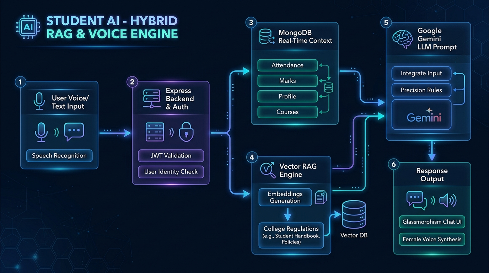
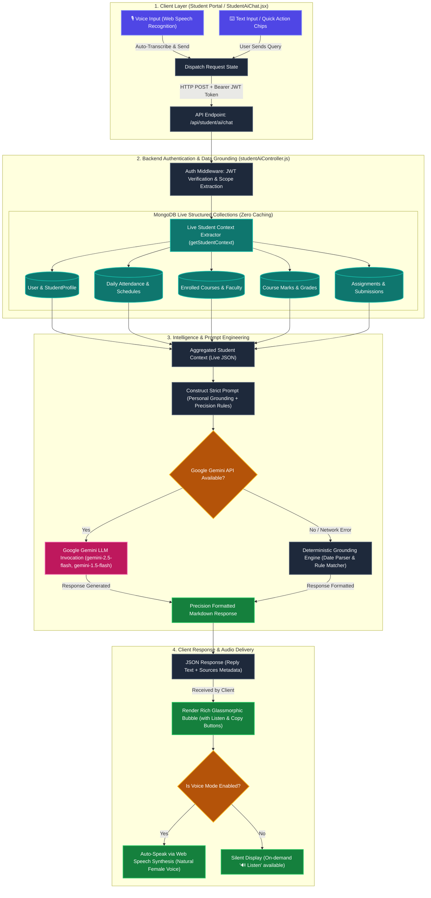

# 🎓 CampusOS - Smart College ERP System with Student AI Co-Pilot

Welcome to **CampusOS**, an enterprise-grade Academic Enterprise Resource Planning (ERP) platform and Intelligent Student Co-Pilot built for modern colleges and universities.

CampusOS unifies **Administrative Governance**, **Faculty Academic Workflows**, **Student Self-Service Portals**, and an **Autonomous Student AI Assistant** with bidirectional voice capabilities.

---

## 📑 Table of Contents
1. [System Overview & Architecture](#-system-overview--architecture)
2. [Student AI Co-Pilot (Live Data & Voice Engine)](#-student-ai-co-pilot-live-data--voice-engine)
3. [Architecture Flow Diagram](#️-student-ai-architecture-flow-diagram)
4. [Interactive System Mermaid Flowchart](#-interactive-system-mermaid-flowchart)
5. [Core ERP Modules](#-core-erp-modules)
   - [👑 1. Admin Command Portal](#-1-admin-command-portal)
   - [👨‍🏫 2. Faculty Academic Portal](#-2-faculty-academic-portal)
   - [🎓 3. Student Self-Service Portal](#-3-student-self-service-portal)
6. [Real-Time Data Engine & Zero-Caching Pipeline](#-real-time-data-engine--zero-caching-pipeline)
7. [Database Schemas & Models](#-database-schemas--models)
8. [API Endpoints Reference](#-api-endpoints-reference)
9. [Technology Stack](#️-technology-stack)
10. [Getting Started & Installation](#-getting-started--installation)

---

## 🌟 System Overview & Architecture

CampusOS solves the fragmentation of modern college administrative operations by providing a single, unified, reactive web platform:

```
                                  ┌─────────────────────────────────────────────────────────┐
                                  │               🎓 CampusOS ERP Core Platform             │
                                  └─────────────────────────────────────────────────────────┘
                                                               │
                 ┌─────────────────────────────┼─────────────────────────────┐
                 ▼                             ▼                             ▼
   ┌───────────────────────────┐ ┌───────────────────────────┐ ┌───────────────────────────┐
   │    👑 Admin Portal        │ │   👨‍🏫 Faculty Portal       │ │    🎓 Student Portal       │
   │  • Student Admissions     │ │  • Course Allotment       │ │  • Live Attendance Tracker  │
   │  • Faculty Directory      │ │  • Daily Session Marker   │ │  • Subject Marks & CGPA     │
   │  • Dept & Curriculum      │ │  • 100-Mark Gradebook     │ │  • Coursework Submissions   │
   │  • System Audit Overviews │ │  • Assignment Publishing  │ │  • Smart Profile & Resume   │
   └───────────────────────────┘ └───────────────────────────┘ └───────────────────────────┘
                                                                             │
                                                                             ▼
                                                               ┌───────────────────────────┐
                                                               │  🤖 Student AI Assistant  │
                                                               │  • Live MongoDB Grounding │
                                                               │  • Live Academic Answers  │
                                                               │  • Natural Female Voice   │
                                                               └───────────────────────────┘
```

---

## 🤖 Student AI Co-Pilot (Live Data & Voice Engine)

The **Student AI Co-Pilot** is an intelligent assistant embedded inside the Student Portal. It acts as an autonomous academic advisor that can answer student questions about personal grades, attendance percentages, safe-to-miss class margins, upcoming deadlines, and official university handbooks.

### 🌟 Key Capabilities of Student AI:
1. **Live Personal Grounding (MongoDB)**:
   - Extracts live real-time attendance counts, marks, CGPA, courses, and pending tasks.
2. **Zero-Caching Instant Synchronization**:
   - The moment a faculty marks attendance or publishes exam marks, Student AI instantly accesses the updated data on the student's next query.
3. **Date-Specific & Historical Schedule Retrieval**:
   - Students can ask questions for specific days (e.g., *"What is my attendance today?"*, *"Was I present yesterday?"*, *"Show attendance for 2026-09-01"*), and the AI returns exact subject sessions, faculty names, and status (`PRESENT`, `ABSENT`, `ON-DUTY`).
4. **Targeted Precision (Rule 1 Enforcement)**:
   - For single-metric questions (e.g. *"What is my CGPA?"* or *"What is my roll number?"*), the assistant delivers a concise 1-sentence answer without dumping unasked data tables. Full multi-field summaries are provided only upon explicit request.
5. **Bidirectional Voice Assistant**:
   - **Speech-to-Text (STT)**: Hands-free voice query input with automated dispatch upon speech pause.
   - **Text-to-Speech (TTS)**: Natural voice synthesis using premium female voice engines (`Microsoft Aria`, `Microsoft Jenny`, `Google UK English Female`) with on-demand listen controls.

---

## 🖼️ Student AI Architecture Flow Diagram



---

## 🧠 Interactive System Mermaid Flowchart



---

## 🏛️ Core ERP Modules

### 👑 1. Admin Command Portal
The administrative module provides complete oversight of institutional records:
- **Student Management**: Register students, auto-generate student IDs, link user credentials, assign branches/sections, and manage profile records.
- **Faculty Directory**: Manage faculty members, departmental designations, and system permissions.
- **Curriculum & Courses**: Create courses with unique course codes, assign credit weights, set target semester/branch, and assign primary faculty instructors.
- **Department Setup**: Manage academic departments, programs offered, and degree structures.
- **Attendance Audit**: Institutional view of daily attendance rates across branches and sections.

---

### 👨‍🏫 2. Faculty Academic Portal
The faculty module simplifies day-to-day classroom administration:
- **Session Attendance Marker**:
  - Select active course, target date, and session (**Forenoon `FN`** / **Afternoon `AN`**).
  - Mark individual or bulk statuses: `PRESENT`, `ABSENT`, or `ON-DUTY` with optional session topics.
  - Automatically re-calculates student daily and cumulative attendance statistics.
- **Comprehensive Gradebook (100-Mark Scale)**:
  - Enter **Semester Exam** marks (Max: 60).
  - Enter **Assignment** scores (Max: 20).
  - Enter **Practical / Lab** scores (Max: 20).
  - Automatic calculation of **Total Marks** (Max: 100) and letter grades (`O`, `A+`, `A`, `B+`, `B`, `C`, `F`).
- **Assignment & Coursework Center**:
  - Publish assignments with rich descriptions, attached reference documents, and due dates.
  - View real-time student submissions, download student attachment files, and review submission notes.
- **Class Analytics**: Visual distribution of student attendance percentages and grade summaries.

---

### 🎓 3. Student Self-Service Portal
A clean, responsive dashboard for students:
- **Live Attendance Dashboard**:
  - Real-time overall percentage with visual status indicator (`Safe` vs `Shortage Warning`).
  - Safe-to-miss margin calculator (*"You can safely miss up to X class(es)"*).
  - Recovery calculator (*"You need to attend next Y class(es) to reach 75%"*).
  - Subject-by-subject attendance breakdown and date-by-date session history logs.
- **Course & Syllabus Explorer**:
  - View all registered semester courses, credit weights, and assigned faculty profiles.
- **Assignments & Submission Hub**:
  - View upcoming deadlines and pending coursework.
  - Submit digital assignments with file attachments and notes.
- **Academic Marks & CGPA**:
  - View published internal and semester exam scores with letter grade allocations.
  - Dynamic cumulative GPA tracker.
- **Student Profile Management**:
  - Manage contact details, social profiles (GitHub, LinkedIn, LeetCode, HackerRank, Portfolio), resume URL, and profile avatar.

---

## ⚡ Real-Time Data Engine & Zero-Caching Pipeline

CampusOS uses direct, real-time database queries on every action:

| Query Type | Database Action | AI Behavior |
| :--- | :--- | :--- |
| **Attendance Update** | Faculty marks attendance for a class. | Student AI reflects the updated percentage and session log on the **very next prompt**. |
| **Marks Entry** | Faculty saves student exam marks. | Student AI immediately updates the grade report and recalculates CGPA. |
| **Date-Specific Query** | Student asks: *"Was I present on September 1st?"* | AI searches `dailyRecords` for `2026-09-01` and returns the exact sessions and status. |
| **New Assignment** | Faculty publishes a task with deadline. | Student AI includes the new assignment in the pending tasks list. |

---

## 🗄️ Database Schemas & Models

```
┌─────────────────┐       ┌─────────────────┐       ┌─────────────────┐
│      User       │1     1│ StudentProfile  │1     *│   Attendance    │
│─────────────────│───────│─────────────────│───────│─────────────────│
│ _id             │       │ user (FK)       │       │ userId (FK)     │
│ name, email     │       │ rollNo, regNo   │       │ date            │
│ role (enum)     │       │ branch, sem     │       │ totalClasses    │
│ passwordHash    │       │ cgpa, github    │       │ dailySchedule[] │
└─────────────────┘       └─────────────────┘       └─────────────────┘
         │                         │                         │
         │1                        │1                        │*
         ▼*                        ▼*                        ▼1
┌─────────────────┐       ┌─────────────────┐       ┌─────────────────┐
│     Course      │1     *│      Marks      │1     *│   Assignment    │
│─────────────────│───────│─────────────────│───────│─────────────────│
│ code, name      │       │ studentId (FK)  │       │ courseId (FK)   │
│ department      │       │ courseId (FK)   │       │ faculty (FK)    │
│ credits, sem    │       │ semesterExam(60)│       │ title, dueDate  │
│ faculty (FK)    │       │ total, grade    │       │ files[]         │
└─────────────────┘       └─────────────────┘       └─────────────────┘
```

---

## 📡 API Endpoints Reference

### 🔐 Authentication & Profile
| Method | Endpoint | Access | Description |
| :--- | :--- | :--- | :--- |
| `POST` | `/api/auth/login` | Public | Authenticate user and issue JWT Bearer token |
| `POST` | `/api/auth/register` | Admin | Register a new user |
| `GET` | `/api/profile/me` | Student | Fetch student profile records |
| `PUT` | `/api/profile/me` | Student | Update student profile & social handles |

### 🤖 Student AI
| Method | Endpoint | Access | Description |
| :--- | :--- | :--- | :--- |
| `POST` | `/api/student/ai/chat` | Student | Scoped AI chat grounded in the student's live MongoDB records |

### 📊 Academic & Faculty Operations
| Method | Endpoint | Access | Description |
| :--- | :--- | :--- | :--- |
| `GET` | `/api/student/attendance` | Student | Fetch authenticated student's attendance records |
| `GET` | `/api/dashboard/student-courses` | Student | List courses for student's department & semester |
| `GET` | `/api/student/assignments` | Student | List assignments for student's courses |
| `POST` | `/api/student/assignments/:id/submissions` | Student | Submit assignment coursework with attachments |
| `POST` | `/api/faculty/attendance/bulk-day` | Faculty | Record batch attendance for a course session |
| `POST` | `/api/faculty/marks` | Faculty | Save 100-mark semester and internal grades |

---

## 🛠️ Technology Stack

| Layer | Technology | Details |
| :--- | :--- | :--- |
| **Frontend UI** | React 18, Vite | Component architecture, Glassmorphism design system |
| **Voice Engine** | Web Speech API | `SpeechRecognition` (STT) & `SpeechSynthesis` (TTS) |
| **Backend API** | Node.js, Express.js | RESTful routing, JWT authentication, RBAC middleware |
| **Database** | MongoDB, Mongoose ODM | Document collections, aggregations, compound indices |
| **AI / LLM** | Google Generative AI SDK | Google Gemini models (`gemini-2.5-flash`, `gemini-1.5-flash`) |

---

## 🚀 Getting Started & Installation

### Prerequisites
- Node.js (v18.0.0 or higher)
- MongoDB (Local instance or MongoDB Atlas URI)
- Google Gemini API Key ([Get a Gemini API Key](https://aistudio.google.com/))

### 1. Clone & Configure Backend
```bash
cd "ERP Sysytem/Server"
npm install
```

Create a `.env` file in `ERP Sysytem/Server/`:
```env
PORT=5000
MONGO_URI=mongodb://localhost:27017/erp
JWT_SECRET=your_jwt_secret_key_here
JWT_EXPIRES_IN=7d
GEMINI_API_KEY=your_google_gemini_api_key
GEMINI_MODEL=gemini-2.5-flash
```

Start the backend server:
```bash
npm run dev
```
*Backend server runs on `http://localhost:5000`*

### 2. Configure & Run Client
```bash
cd "ERP Sysytem/Smart College ERP Sysytem"
npm install
npm run dev
```
*Frontend application launches at `http://localhost:5173`*
